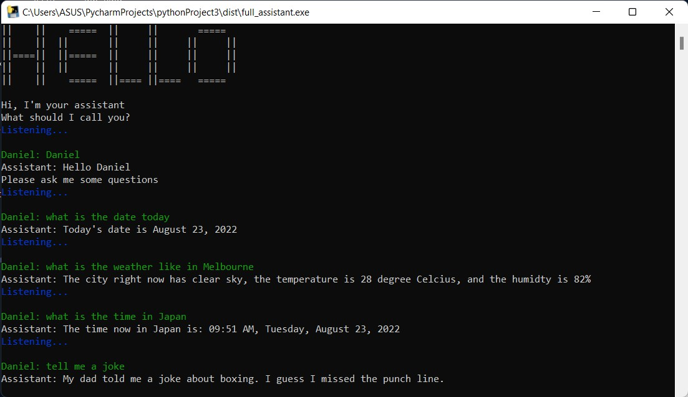
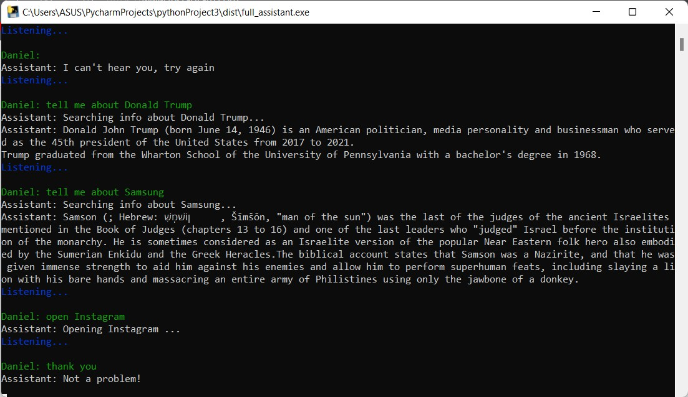

# Simple A.I. Voice Virtual Assistant
This is a simple console A.I. I created with Python. It can listen to your voice and answer your questions.
 
## Screenshot

### What the virtual assistant can do:
* Hello
* Today'date
* Weather in any city
* Time in any city 
* Tell a random joke/funny line
* Open any online application name (e.g., Facebook, Twitter, YouTube, etc)
* Search anything the user needs on Google
* Link to Wikipedia and gives information about what the user wants to know (e.g., "Tell me about Donald Trump")
* Thank you or Bye to automatically quit
